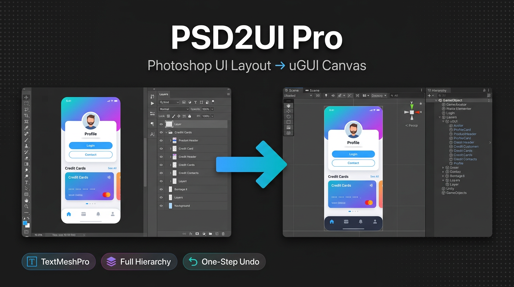

# PSD2UI Pro



**Import Photoshop UI layouts into Unity as pixel-accurate uGUI hierarchies** — with editable TextMeshPro text, full layer tree, and nine pivot presets.

---

## How it works

1. Run **`Photoshop/psd2ui_export.jsx`** in Adobe Photoshop and choose an output folder.
2. Pick **Export as Images** (raster text) or **Export as Text** (metadata for TextMeshPro in Unity).
3. In Unity, open **`Window > PSD2UI Pro`**, select the exported **`layout.json`**, then **Import**.

---

## Features

| | |
|---|---|
| **Positioning** | Layer bounds transferred exactly; Photoshop coordinates converted to Unity UI space. |
| **Hierarchy** | Groups become parents; stacking order preserved as sibling order. |
| **Text** | Optional TextMeshProUGUI from export metadata, or rasterized PNGs. |
| **Opacity** | `CanvasGroup` on groups with opacity &lt; 100%. |
| **Effects** | Styles, masks, and smart objects baked during Photoshop export. |
| **Editor UX** | Drag-and-drop `layout.json`, inline preview, stat cards, batched import, single Undo step. |
| **Pivots** | Nine presets: center, corners, and edge midpoints. |

---

## What gets created in Unity

- **Canvas** — Auto-created (`ScaleWithScreenSize` to PSD size) or parented under your target canvas.
- **Images** — `Image` + sprite from PNG; raycast target off by default.
- **Text** — `TextMeshProUGUI` when exported as text metadata.
- **Groups** — Parent `GameObject`s; optional `CanvasGroup` for group alpha.
- **Hidden layers** — Inactive `GameObject`s when **Respect Visibility** is on.

---

## Installation

### Option A — Unity Package Manager (Git URL)

1. In Unity: **Window → Package Manager**.
2. Click **+** → **Add package from git URL…**
3. Enter:

   ```
   https://github.com/Marwan0/PSD2UI-Pro.git
   ```

   Optional: pin a branch or tag, e.g. `https://github.com/Marwan0/PSD2UI-Pro.git#main` or `#v1.0.0`.

Or add to **`Packages/manifest.json`** under `dependencies`:

```json
"com.marwan0.psd2ui-pro": "https://github.com/Marwan0/PSD2UI-Pro.git"
```

The package installs under **Packages** and **TextMeshPro** is pulled in as a dependency when needed.

### Option B — Copy the folder

Copy the plugin folder into your project under **`Assets/`**.

### Option C — Git clone into Assets

```bash
cd Assets
git clone https://github.com/Marwan0/PSD2UI-Pro.git "PSD2UI Pro"
```

**Default import path for sprites:** `Assets/PSD2UI Imports` (configurable in the importer window).

---

## Requirements

- **Unity** 2021.3 LTS or newer  
- **TextMeshPro** (`com.unity.textmeshpro` — included with Unity)  
- **Adobe Photoshop** CC 2018+ (for `psd2ui_export.jsx`)

---

## Documentation

See **[PSD2UI_PRO_GUIDE.md](PSD2UI_PRO_GUIDE.md)** for a short quick-reference.

---

## Limitations

- Smart objects and layer effects are baked to PNG during export.
- Animations are not imported.
- TMP defaults (font/size/color) should be adjusted after import.

---

## License

MIT License — see [LICENSE](LICENSE).

---

*PSD2UI Pro v1.0*
